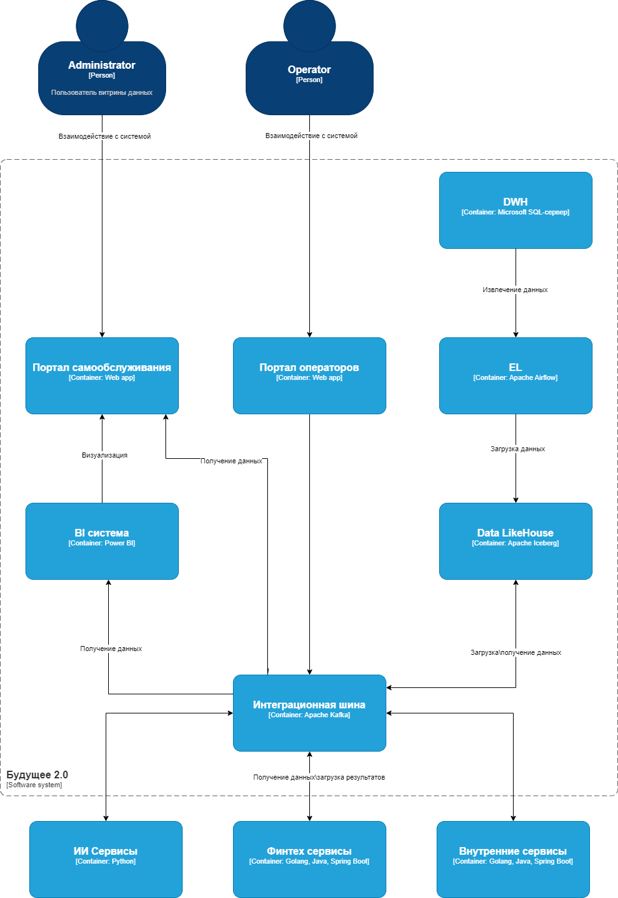
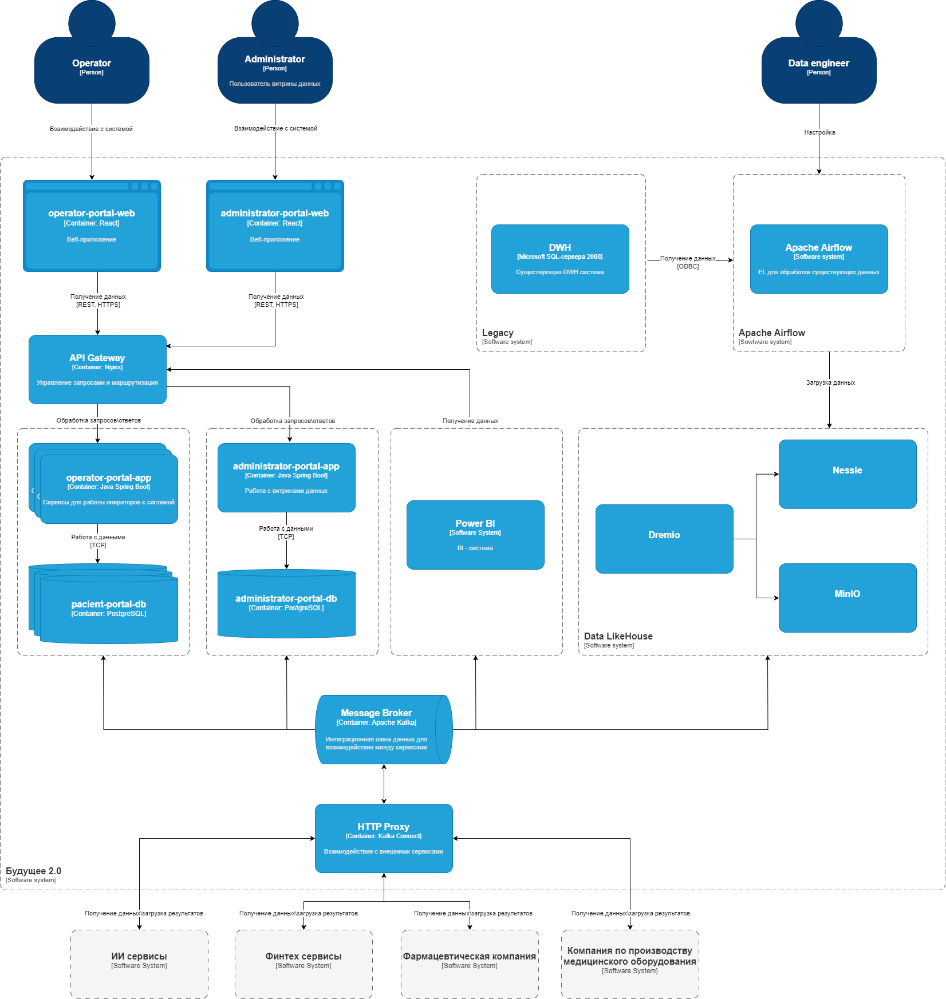

# Задание 1

## 1. Архитектура системы через год.

[Диаграмма контейнеров и компонентов в формате drawio](с4.drawio)

## 2. Проблемные места.

**1. Устаревшая технологическая база**

- **Проблема**: Использование SQL Server 2008 года, который уже не поддерживается и не соответствует современным требованиям по производительности и безопасности.
- **Последствия**:
  - Низкая скорость обработки данных, особенно при работе с большими объемами (сотни терабайт).
  - Ограниченная возможность масштабирования.
  - Риски безопасности из-за отсутствия обновлений и поддержки.
- **Решение**: Миграция на современную платформу.
-----
**2. Медленная генерация отчетов**

- **Проблема**: Сложные отчеты строятся часами из-за большого объема данных и множества трансформаций.
- **Последствия**:
  - Задержки в принятии решений.
  - Низкая удовлетворенность сотрудников, которые зависят от отчетов.
  - Замедление time-to-market для новых продуктов и услуг.
- **Решение**: Оптимизация ETL/ELT процессов, внедрение Data Lakehouse для хранения данных и использование современных BI-инструментов.
-----
**3. Сложность интеграции новых бизнесов**

- **Проблема**: Добавление новых направлений (например, фармацевтических компаний или производителей оборудования) требует значительных изменений в DWH и бизнес-логике.
- **Последствия**:
  - Высокие затраты на разработку и поддержку.
  - Долгие сроки внедрения новых сервисов.
  - Риск ошибок при интеграции.
- **Решение**: Переход на микросервисную архитектуру и использование шины данных (например, Apache Kafka) для упрощения интеграции.
-----
**4. Отсутствие единой витрины данных**

- **Проблема**: Нет удобного инструмента для самостоятельного создания отчетов и анализа данных сотрудниками.
- **Последствия**:
  - Зависимость от IT-отдела для создания отчетов.
  - Невозможность быстро получить нужные данные для принятия решений.
  - Ограниченная гибкость в аналитике.
- **Решение**: Создание портала самообслуживания с возможностью конструирования отчетов и анализа данных в реальном времени.
-----
**5. Перегруженность DWH**

- **Проблема**: В DWH хранятся все данные, включая те, которые не используются для аналитики (например, медицинские карты и истории болезней).
- **Последствия**:
  - Избыточная нагрузка на систему.
  - Увеличение времени обработки запросов.
  - Сложности в управлении данными.
- **Решение**: Выделение данных, не используемых для аналитики, в отдельные хранилища (например, Data Lake) и оптимизация структуры DWH.
-----
**6. Устаревшая шина данных**

- **Проблема**: Использование Apache Camel, который может не справляться с текущими объемами данных и требованиями по скорости обработки.
- **Последствия**:
  - Задержки в обмене данными между системами.
  - Ограниченная поддержка современных протоколов и стандартов.
  - Сложности в масштабировании.
- **Решение**: Переход на более современные технологии, такие как Apache Kafka или облачные решения.
-----
**7. Отсутствие гибкости в BI-системе**

- **Проблема**: Существующая BI-система (Power BI) сильно кастомизирована и зависит от DWH.
- **Последствия**:
  - Ограниченная возможность адаптации под новые требования.
  - Высокие затраты на поддержку и доработку.
  - Зависимость от IT-специалистов для настройки отчетов.
- **Решение**: Оптимизация BI-системы, интеграция с современными инструментами и предоставление сотрудникам возможности самостоятельной работы с данными.
-----
**8. Риски безопасности данных**

- **Проблема**: Устаревшие системы и отсутствие единой политики управления доступом к данным.
- **Последствия**:
  - Риск утечки конфиденциальной информации (например, медицинских или финансовых данных).
  - Несоответствие требованиям регуляторов (например, GDPR, HIPAA).
  - Возможные штрафы и репутационные потери.
- **Решение**: Внедрение современных систем управления доступом и шифрования данных, а также регулярный аудит безопасности.
-----
**9. Недостаточная производительность ИИ-сервисов**

- **Проблема**: ИИ-сервисы, работающие на Python, могут не справляться с растущими объемами данных.
- **Последствия**:
  - Задержки в обработке медицинских данных.
  - Низкая точность прогнозов из-за недостаточной производительности.
  - Ограниченная возможность масштабирования.
- **Решение**: Оптимизация ИИ-моделей, использование облачных решений для машинного обучения и внедрение распределенных вычислений.

## 3. Приоритезация выявленных проблем

||Важно|Не важно|
| :- | :-: | :-: |
|Срочно|
- Устаревшая технологическая база (SQL Server 2008)

- Медленная генерация отчетов

- Риски безопасности данных
|
- Устаревшая шина данных (Apache Camel)

- Сложность интеграции новых бизнесов:
|
|Не срочно|
- Отсутствие единой витрины данных

- Перегруженность DWH

- Отсутствие гибкости в BI-системе
|- Недостаточная производительность ИИ-сервисов|
