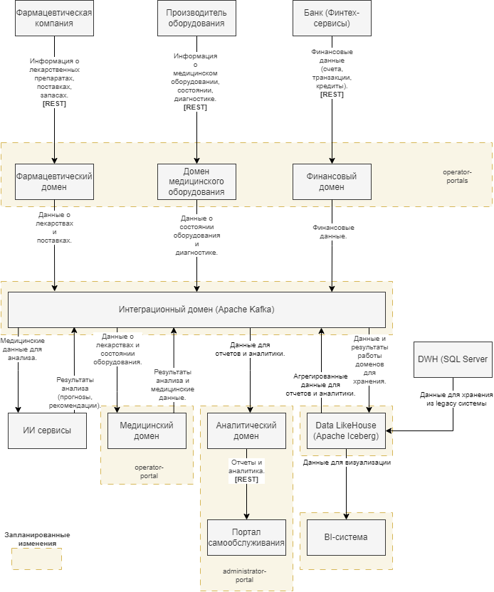

# Задание 2

## 1. Основные домены системы.

1. **Медицинский домен**

- Данные:
  - Медицинские карты, истории болезней, результаты анализов.
- Сервисы:
  - ИИ-сервисы для анализа медицинских данных.
  - Сервисы для управления медицинскими записями.
- Интеграция:
  - Взаимодействует с интеграционным доменом через Kafka.
  - Получает данные от фармацевтического домена и домена медицинского оборудования.

2. **Фармацевтический домен**

- Данные:
  - Информация о лекарственных препаратах, поставки, запасы.
- Сервисы:
  - Сервисы для управления запасами лекарств.
  - Сервисы для анализа эффективности препаратов.
- Интеграция:
  - Взаимодействует с интеграционным доменом через Kafka.
  - Передает данные в медицинский домен и аналитический домен.

3. **Домен медицинского оборудования**

- Данные:
  - Информация о медицинском оборудовании, состояние, диагностика.
- Сервисы:
  - Сервисы для мониторинга состояния оборудования.
  - Сервисы для планирования обслуживания.
- Интеграция:
  - Взаимодействует с интеграционным доменом через Kafka.
  - Передает данные в медицинский домен и аналитический домен.

4. **Финансовый домен**

- Данные:
  - Счета, транзакции, кредиты, страховые выплаты.
- Сервисы:
  - Финтех-сервисы для управления счетами и кредитами.
  - Сервисы для анализа финансовых данных.
- Интеграция:
  - Взаимодействует с интеграционным доменом через Kafka.
  - Передает данные в аналитический домен.

5. **Аналитический домен**

- Данные:
  - Агрегированные данные из всех доменов.
- Сервисы:
  - Портал самообслуживания для создания отчетов.
  - BI-система (Power BI) для визуализации данных.
- Интеграция:
  - Получает данные из всех доменов через интеграционный домен.

6. **Интеграционный домен**

- Данные:
  - Потоки данных между доменами и внешними системами.
- Сервисы:
  - Шина данных (Apache Kafka) для обмена сообщениями.
  - Kafka Connect для интеграции с внешними системами.
- Интеграция:
  - Обеспечивает связь между всеми доменами.
  
## 2. Потоки данных между доменами.

[Диаграмма потоков данных в формате drawio](dfd.drawio)

## 3. Преимущества разделения на домены.

1. **Независимость**

- Каждый домен соответствует конкретной бизнес-области и может развиваться независимо, без необходимости изменять другие домены. 

2. **Масштабируемость**

- Домены можно масштабировать независимо в зависимости от нагрузки. Домены взаимодействуют через интеграционный домен (Apache Kafka), что минимизирует прямые зависимости между ними.
- Эффективное использование ресурсов, ресурсы (например, серверы, базы данных) выделяются только для тех доменов, которые в них нуждаются.

3. **Упрощение разработки**

- Изолированные команды, разработчики могут сосредоточиться на своей области, не затрагивая другие части системы.
- Снижение сложности, разделение системы на домены уменьшает общую сложность, так как каждый домен решает конкретные задачи.

4. **Гибкость**

- Быстрое внедрение изменений, каждый домен может внедрять изменения независимо, не затрагивая другие части системы.
- Поддержка новых бизнес-направлений, новые функции и сервисы можно добавлять в отдельные домены без влияния на всю систему.

5. **Упрощение тестирования**

- Каждый домен можно тестировать изолированно, что упрощает выявление и исправление ошибок.

6. **Повышение надежности**

- Изоляция сбоев, сбои в одном домене не влияют на работу других доменов.
- Гарантированная доставка данных, использование Kafka в интеграционном домене обеспечивает надежную доставку данных даже в случае сбоев.

7. **Улучшение аналитики и отчетности**

- Централизованная аналитика, аналитический домен агрегирует данные из всех доменов, что позволяет получать единую картину бизнеса.
- Гибкость в создании отчетов, портал самообслуживания позволяет сотрудникам создавать отчеты по любым срезам данных.

###Преимущества в контексте компании «Будущее 2.0»

**Ускорение time-to-market**

- Новые функции (например, интеграция с новой фармацевтической компанией) можно внедрять быстрее, так как изменения ограничены одним доменом.
- Например, добавление нового источника данных в **фармацевтический домен** не требует изменений в **медицинском домене**.

**Снижение затрат на разработку**

- Изолированные домены упрощают разработку и тестирование, что снижает затраты на поддержку.
- Например, исправление ошибки в **финансовом домене** не требует тестирования всей системы.

**Улучшение качества данных**

- Каждый домен отвечает за свои данные, что обеспечивает их согласованность и актуальность.
- Например, **медицинский домен** гарантирует, что медицинские данные всегда актуальны и корректны.

**Поддержка регуляторных требований**

- Разделение данных по доменам упрощает соблюдение регуляторных требований (например, GDPR, HIPAA).
- Например, медицинские данные хранятся и обрабатываются только в **медицинском домене**, что упрощает контроль доступа.
