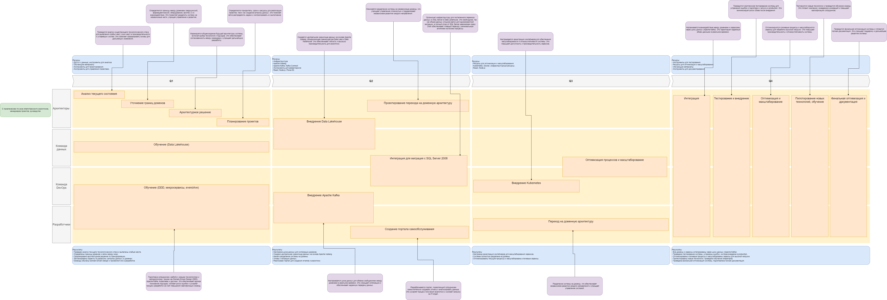

# Задание 3

## 1. Технический радар.

1. **Языки программирования и фреймворки**

|**Статус**|**Технология/Методология**|**Комментарии**|
| :-: | :-: | :-: |
|**Adopt**|Python|Основной язык для ИИ-сервисов и обработки данных.|
||Java|Для финтех-сервисов и backend-разработки.|
||Go|Для высокопроизводительных микросервисов.|
||TensorFlow|Основной фреймворк для машинного обучения.|
||React|Для разработки фронтенда портала самообслуживания.|
||Node.js|Для разработки backend портала самообслуживания.|
|**Trial**|PyTorch|Альтернатива TensorFlow, стоит протестировать.|
|**Assess**|Rust|Для высокопроизводительных и безопасных систем.|
|**Hold**|Power Builder|Устаревшая технология для разработки интерфейсов, от которой стоит отказаться.|

2. **Инструменты**

|**Статус**|**Технология/Методология**|**Комментарии**|
| :-: | :-: | :-: |
|**Adopt**|Apache Iceberg|Рекомендуется как основа для Data Lakehouse.|
||Apache Airflow|Основной инструмент для ETL/ELT и обработки больших данных.|
||Apache Kafka|Основная шина данных для интеграции доменов.|
||Kafka Connect|Для интеграции с внешними системами.|
||MLflow|Для управления жизненным циклом моделей.|
||Power BI|Основной инструмент для визуализации данных.|
||Docker|Для контейнеризации приложений.|
||Kubernetes|Для оркестрации контейнеров и масштабирования.|
|**Trial**|Delta Lake|Альтернатива Apache Iceberg, стоит протестировать.|
||Apache Superset|Альтернатива Power BI с открытым исходным кодом.|
|**Assess**|Presto|Для выполнения распределенных SQL-запросов.|
|**Hold**|Apache Camel|Используется как текущая шина данных, но рекомендуется заменить на Kafka.|
||Power Builder|Устаревший инструмент для разработки интерфейсов, от которого стоит отказаться.|

3. **Платформы**

|**Статус**|**Технология/Методология**|**Комментарии**|
| :-: | :-: | :-: |
|**Adopt**|Microsoft Azure|Облачная платформа для миграции с SQL Server 2008.|
||Azure SQL Database|Современная замена для SQL Server 2008.|
|**Assess**|Snowflake|Облачное хранилище данных для аналитики.|
|**Hold**|SQL Server 2008|Устаревшая версия SQL Server, от которой стоит отказаться.|

4. **Методы**

|**Статус**|**Технология/Методология**|**Комментарии**|
| :-: | :-: | :-: |
|**Adopt**|Domain-Driven Design (DDD)|Для разделения системы на домены.|
||Microservices Architecture|Для построения гибкой и масштабируемой архитектуры.|
||REST API|Основной протокол для синхронной интеграции.|
||Шина данных|Используется для интеграции|
|**Trial**|gRPC|Для высокопроизводительной интеграции между микросервисами.|
|**Assess**|Data Mesh|Подход к управлению данными, стоит изучить для будущего внедрения.|
||Event Sourcing|Для управления изменениями состояния системы через события.|
|**Hold**|Монолитная архитектура|Устаревший подход, от которого стоит отказаться в пользу микросервисов.|

## 2. Роадмап.

[Роадмап в формате drawio](roadmap.drawio)

